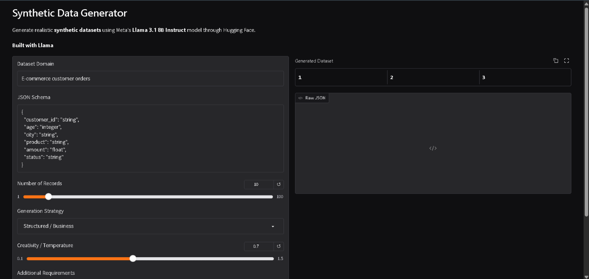

# Synthetic Data Generator

An AI-powered web application for generating realistic synthetic datasets from a user-defined domain and JSON schema. The application uses Meta Llama 3.1 8B Instruct through Hugging Face inference and provides an interactive Gradio interface for configuring and generating structured synthetic data.

## Live Demo

[Open the Synthetic Data Generator](https://synthetic-data-generator-44m9.onrender.com)

The application is deployed on Render and uses Hugging Face for Llama inference.

## Application Screenshot



## Features

- AI-powered synthetic dataset generation
- Meta Llama 3.1 8B Instruct
- User-defined dataset domains and schemas
- Generate between 1 and 100 records
- Three generation strategies:
  - Structured / Business
  - Diverse / Creative
  - Edge Cases / Testing
- Adjustable temperature for controlling generation variability
- Additional custom requirements
- JSON output validation and extraction
- Interactive Pandas DataFrame output
- Raw JSON output
- Gradio web interface
- Cloud deployment through Render
- Secure environment-variable based API token configuration

## Architecture

```text
                         User
                           |
                           v
                +----------------------+
                |   Gradio Interface   |
                |                      |
                | Domain + JSON Schema |
                | Records + Strategy   |
                | Temperature + Rules  |
                +----------+-----------+
                           |
                           v
                +----------------------+
                |    Prompt Builder    |
                |                      |
                | Strategy + Schema +  |
                | Requirements         |
                +----------+-----------+
                           |
                           v
                +----------------------+
                | Hugging Face         |
                | Inference            |
                |                      |
                | Llama 3.1 8B         |
                | Instruct             |
                +----------+-----------+
                           |
                           v
                +----------------------+
                |   JSON Extraction    |
                |    and Validation    |
                +----------+-----------+
                           |
                    +------+------+
                    |             |
                    v             v
             +-----------+   +-----------+
             | DataFrame |   | Raw JSON  |
             |   Output  |   |   Output  |
             +-----------+   +-----------+
```

## How It Works

### 1. Define the dataset domain

The user specifies the type of synthetic data to generate.

Example:

```text
E-commerce customer orders
```

### 2. Define the schema

The user specifies the expected structure of each record.

Example:

```json
{
  "customer_id": "string",
  "age": "integer",
  "city": "string",
  "product": "string",
  "amount": "float",
  "status": "string"
}
```

### 3. Configure generation

The user can configure:

- Number of records
- Generation strategy
- Temperature
- Additional requirements

Example:

```text
amount should be between 100 and 5000
```

### 4. Construct the prompt

The application combines the domain, requested schema, number of records, selected generation strategy, and additional requirements into a structured prompt.

### 5. Generate synthetic data

The prompt is sent to Meta Llama 3.1 8B Instruct through Hugging Face inference.

The model is instructed to return a JSON array containing fictional synthetic records.

### 6. Validate and display the result

The application extracts the JSON response, validates that it is a JSON array, converts the records into a Pandas DataFrame, and displays both an interactive dataset table and the raw JSON response.

## Generation Strategies

### Structured / Business

Designed for realistic business-oriented datasets such as:

- E-commerce orders
- Customer records
- Sales data
- Inventory records
- Banking transactions
- Business operations

### Diverse / Creative

Designed to increase variation between generated records.

The prompt encourages variation in:

- Names
- Locations
- Categories
- Numerical values
- Record characteristics

### Edge Cases / Testing

Designed for software testing and test-data generation.

The prompt requests mostly normal records while also introducing realistic:

- Boundary values
- Unusual combinations
- Edge cases
- Testing scenarios

## Example

### Input

Domain:

```text
E-commerce customer orders
```

Schema:

```json
{
  "customer_id": "string",
  "age": "integer",
  "city": "string",
  "product": "string",
  "amount": "float",
  "status": "string"
}
```

Additional requirement:

```text
amount should be between 100 and 5000
```

### Example Output

```json
[
  {
    "customer_id": "CUST-1042",
    "age": 28,
    "city": "Pune",
    "product": "Wireless Headphones",
    "amount": 2499.50,
    "status": "Delivered"
  },
  {
    "customer_id": "CUST-1087",
    "age": 35,
    "city": "Bengaluru",
    "product": "Mechanical Keyboard",
    "amount": 4199.00,
    "status": "Processing"
  }
]
```

The generated records are then converted into a tabular DataFrame for easier inspection.

## Technology Stack

| Technology | Purpose |
|---|---|
| Python | Application development |
| Meta Llama 3.1 8B Instruct | Synthetic data generation |
| Hugging Face | LLM inference |
| Gradio | Web interface |
| Pandas | Dataset processing |
| python-dotenv | Local environment configuration |
| Render | Cloud deployment |
| GitHub | Source control |

## Project Structure

```text
synthetic-data-generator/
|
├── images/
│   └── app-screenshot.png
├── app.py
├── requirements.txt
├── .env.example
├── .gitignore
├── LICENSE
├── NOTICE
└── README.md

## Environment Variables

The application requires a Hugging Face access token for model inference.

Create a `.env` file locally:

```env
HF_TOKEN=your_huggingface_token_here
HF_MODEL=meta-llama/Llama-3.1-8B-Instruct
```

Never commit the actual `.env` file or access token to GitHub.

The project includes `.env` in `.gitignore` and provides `.env.example` as a configuration template.

For the deployed application, the Hugging Face token is stored as a secure environment variable in Render.

## Running Locally

### 1. Clone the repository

```bash
git clone https://github.com/Nishad016/synthetic-data-generator.git
cd synthetic-data-generator
```

### 2. Create a virtual environment

On Windows:

```bash
python -m venv venv
venv\Scripts\activate
```

On macOS/Linux:

```bash
python3 -m venv venv
source venv/bin/activate
```

### 3. Install dependencies

```bash
pip install -r requirements.txt
```

### 4. Configure environment variables

Create a `.env` file:

```env
HF_TOKEN=your_huggingface_token_here
HF_MODEL=meta-llama/Llama-3.1-8B-Instruct
```

### 5. Start the application

```bash
python app.py
```

Open the application at:

```text
http://localhost:7860
```

## Deployment

The application is deployed as a Render Web Service connected to the GitHub repository.

### Render configuration

Build command:

```bash
pip install -r requirements.txt
```

Start command:

```bash
python app.py
```

The application reads the `PORT` environment variable provided by Render and binds the Gradio server to `0.0.0.0`.

### Deployment flow

```text
GitHub Repository
       |
       v
     Render
       |
       v
 Python + Gradio Application
       |
       v
 Hugging Face Inference
       |
       v
 Llama 3.1 8B Instruct
```

## Use Cases

Synthetic data generation can be useful for:

- Software testing
- Machine learning experimentation
- Data analysis
- Database testing
- Application prototyping
- Research and experimentation
- Educational projects
- Development environments where real user data should not be used

The application is designed to generate fictional synthetic records rather than expose or reproduce real people's private information.

## Limitations

LLM-generated synthetic data can have limitations:

- Generated values may occasionally be inconsistent.
- The model may not always follow complex schemas perfectly.
- JSON output may occasionally require validation or correction.
- Larger datasets can take longer to generate.
- LLM-generated data should not automatically be considered statistically representative of a real-world population.
- The application is intended for synthetic-data and testing use cases, not for generating or processing real private personal information.

## Model

This project uses Meta Llama 3.1 8B Instruct through Hugging Face inference.

Model:

[Meta Llama 3.1 8B Instruct](https://huggingface.co/meta-llama/Llama-3.1-8B-Instruct)

The model is subject to the Llama 3.1 Community License and applicable Meta terms.

## License and Attribution

This project includes attribution for Meta Llama 3.1.

Llama 3.1 is licensed under the Llama 3.1 Community License.

Copyright © Meta Platforms, Inc. All Rights Reserved.

See the `NOTICE` file for additional attribution information.

## Author

**Nishad016**

This project demonstrates practical skills in:

- Large language model integration
- Prompt engineering
- Structured output generation
- Synthetic data generation
- Data processing with Pandas
- Gradio application development
- Hugging Face inference
- Environment and secret management
- Cloud deployment
- Git and GitHub workflows
